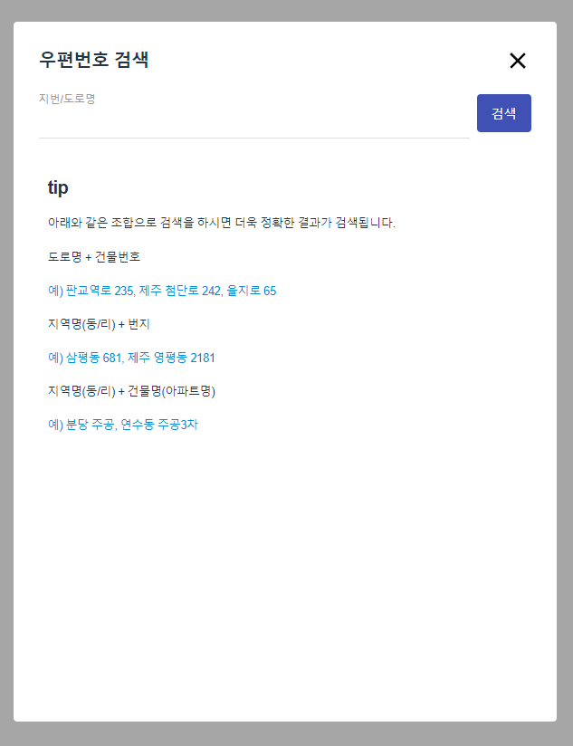

# react-tmap-geo-postcode

---

- vite + react + typescript
- eslint + prettier
- emotion

로컬 실행
```
npm run dev
```

---

## 설명

- Tmap 지오코딩 우편번호 검색을 React 컴포넌트로 사용하도록 하였습니다.
- https://tmapapi.sktelecom.com/main.html#webservice/sample/WebSamplePostCode

```
npm install @zero86/react-tmap-geo-postcode
```

- 예시
```
import { TmapGeoPostcode } from "@zero86/react-tmap-geo-postcode";

export default function App() {
  return (
    <div className="app">
      <div className="postcode">
        <p>우편번호</p>
        <TmapGeoPostcode
          appKey={}
          count={}
          onComplete={}
        />
      </div>
    </div>
  );
}
```

```
interface TmapGeoPostcodeProps {
  appKey: string;
  coordType?:
    | "EPSG3857"
    | "WGS84GEO"
    | "KATECH"
    | "BESSELGEO"
    | "BESSELTM"
    | "GRS80GEO"
    | "GRS80TM"; // default WGS84GEO
  addressFlag?: "F01" | "F02" | "F00"; // default F01
  format?: "json" | "xml";
  count?: number;
  buttonText?: string;
  onComplete(targetRow: RowsType): void;
}
```

- appKey: 사용자가 부여받은 APP_KEY 정보, 필수로 입력해야 합니다.
- coordType: 지구 위의 위치를 나타내는 좌표 타입입니다. (EPSG3857, WGS84GEO, KATECH, BESSELGEO, BESSELTM, GRS80GEO, GRS80TM)
- addressFlag: 주소 구분 코드입니다. (F01, F02, F00)
- format: 데이터 형식 (json, xml)
- count: 페이지당 출력한 데이터 개수
- buttonText: Tmap 우편번호 검색 Modal 창을 여는 버튼 Text 명
- onComplete: 검색 결과에서 선택한 데이터(RowsType 참조)

```
type RowsType = {
  adminDong: string;
  buildingDong: string;
  buildingName: string;
  bunji: string;
  city_do: string;
  eup_myun: string;
  gu_gun: string;
  lat: string;
  latEntr: string;
  legalDong: string;
  lon: string;
  lonEntr: string;
  newBuildingIndex: string;
  newRoadName: string;
  ri: string;
  zipcode: string;
};
```

- adminDong: 출력 좌표에 해당하는 행정동 명칭입니다.
- buildingDong: 구주소 매칭을 한 경우 건물 동을 반환합니다.
- buildingName: 구주소 매칭을 한 경우 건물 명을 반환합니다.
- bunji: 출력 좌표에 해당하는 지번입니다.
- city_do: 출력 좌표에 해당하는 시/도 명칭입니다.
- eup_myun: 출력 좌표에 해당하는 도로명 주소 읍면동 명칭입니다.
- gu_gun: 출력 좌표에 해당하는 군/구 명칭입니다.
- lat: 위도 좌표입니다.
- latEntr: 주소 입구점 위도 좌표입니다.
- legalDong: 출력 좌표에 해당하는 법정동 명칭입니다.
- lon: 경도 좌표입니다.
- lonEntr: 주소 입구점 경도 좌표입니다.
- newBuildingIndex: 새(도로명) 주소 매칭을 한 경우, 건물 번호를 반환합니다.
- newRoadName: 새(도로명) 주소 매칭을 한 경우, 길 이름을 반환합니다.
- ri: 출력 좌표에 해당하는 리 명칭입니다.
- zipcode: 우편번호입니다.

참조: [우편번호 검색-Docs](https://tmapapi.sktelecom.com/main.html#webservice/docs/postCode)

---


  
  


- 현재는 에러 관련해서는 console 창에 출력만 해주고 있습니다.